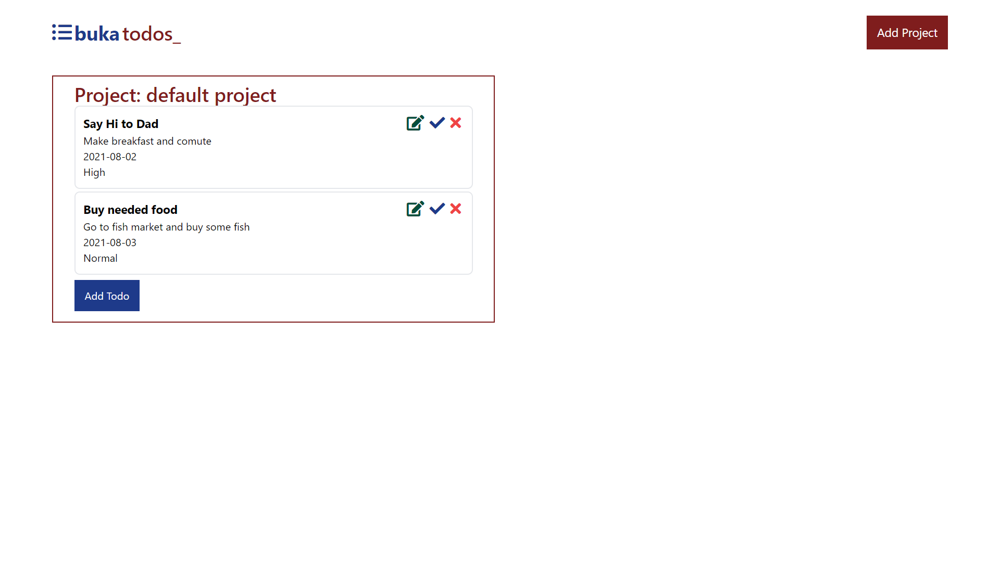

# buka todos_

Simple todolist built with Javascript and webpack

## Screenshots



## Built With 🔨
- Javascript
- Tailwind CSS
- Webpack


## Getting Started 💻

## Installation

To get a local copy of the repository please run the following commands on your terminal:

1. Clone the repo
   ```sh
   git clone https://github.com/omar-labana/buka.git
   ```
2. Install NPM packages
   ```sh
   npm install
   ```
3. Run webpack in dev mode
    ```sh
      npm run dev
     ```
4. open dist/index.html
## 🤝 Contributing

Contributions, issues and feature requests are welcome!

## Show your support

Give a ⭐️ if you like this project!

## Acknowledgments

-  Odin projects
-  Microverse